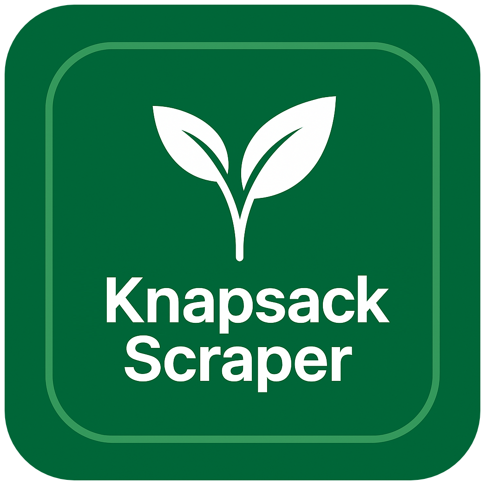

# 🌿 KnapsackScraper

<p align="center">
  
</p>


**KnapsackScraper** adalah sebuah library Python untuk melakukan scraping data dari situs [KNApSAcK Family](https://www.knapsackfamily.com). Library ini cocok digunakan untuk riset kimia, farmasi, botani, dan bioinformatika.

---

## 📦 Fitur Utama

- 🔍 Cari metabolit berdasarkan `keyword` dan `search_type`
- ⚙️ Multiprocessing untuk scraping cepat
- 🧪 Ambil detail lengkap: `InChIKey`, `SMILES`, `Organism`, dll
- 📊 Ekspor hasil ke Excel
- 🌈 Log cantik dan progress bar dengan `rich`

---

## 📁 Struktur Proyek

```
KnapsackScraper/
├── Knapsack.py            # Source utama
├── README.md              # Dokumentasi
├── LICENSE                # MIT License
├── requirements.txt       # Dependensi Python
└── output.xlsx            # (opsional) Hasil scraping
```

---

## 🚀 Instalasi & Setup

### 1. Clone repository

```bash
git clone https://github.com/Arifmaulanaazis/KnapsackScraper.git
cd KnapsackScraper
```

### 2. Install dependensi

Gunakan virtual environment (opsional):

```bash
python -m venv venv
source venv/bin/activate  # Linux/Mac
venv\Scripts\activate     # Windows
```

Lalu install:

```bash
pip install -r requirements.txt
```

---

## 🧪 Cara Penggunaan

```python
from Knapsack import KnapsackScraper

scraper = KnapsackScraper(search_type="all", keyword="Ginkgo Biloba", max_workers=10)
results = scraper.search()
results.to_excel("Ginkgo Biloba.xlsx", index=False)
```

### Penjelasan Parameter:
- `search_type`: tipe pencarian (`all`, `compound`, `organism`, dll)
- `keyword`: kata kunci untuk pencarian
- `max_workers`: jumlah thread untuk pengambilan detail paralel

---

## 📤 Output

Hasil scraping akan berupa file `.xlsx` yang mencakup:
- Kolom utama: `C_ID`, `CAS_ID`, `Metabolite`, `Molecular_Formula`, `Mw`
- Detail tambahan: `InChIKey`, `InChICode`, `SMILES`, `image_url`
- `Organism`: List kingdom/family/species/reference (jika ada)

---

## 🌐 Multi-Bahasa

Klik bagian untuk membuka masing-masing versi:

<details>
<summary>🇬🇧 English</summary>

**KnapsackScraper** is a Python scraper for [KNApSAcK Family](https://www.knapsackfamily.com). It helps researchers extract chemical/biological data easily.

### Installation
```bash
git clone https://github.com/Arifmaulanaazis/KnapsackScraper.git
cd KnapsackScraper
pip install -r requirements.txt
```

### Usage
```python
from Knapsack import KnapsackScraper
scraper = KnapsackScraper(search_type="all", keyword="Ginkgo Biloba", max_workers=10)
df = scraper.search()
df.to_excel("results.xlsx", index=False)
```

</details>

<details>
<summary>🇯🇵 日本語</summary>

KNApSAcK Familyの化合物データを自動収集するPythonスクリプトです。化学・医薬分野の研究に最適です。

### インストール
```bash
git clone https://github.com/Arifmaulanaazis/KnapsackScraper.git
cd KnapsackScraper
pip install -r requirements.txt
```

</details>

<details>
<summary>🇷🇺 Русский</summary>

KnapsackScraper — это парсер для сайта KNApSAcK. Он позволяет быстро собирать биохимические данные для анализа.

```bash
git clone https://github.com/Arifmaulanaazis/KnapsackScraper.git
cd KnapsackScraper
pip install -r requirements.txt
```

</details>

<details>
<summary>🇨🇳 中文 (简体)</summary>

KnapsackScraper 是一个抓取 KNApSAcK 数据的 Python 工具，适用于生物化学相关研究。

```bash
git clone https://github.com/Arifmaulanaazis/KnapsackScraper.git
cd KnapsackScraper
pip install -r requirements.txt
```

</details>

---

## 📃 License

MIT License © 2025 Arif Maulana Azis  
Lihat file `LICENSE` untuk informasi lengkap.

---

## 🙌 Kontribusi

Pull request sangat diterima!  
Laporkan bug dan ide fitur di [Issues](https://github.com/Arifmaulanaazis/KnapsackScraper/issues).

---

## ✨ Credits

Built with ❤️ for scientific progress.
